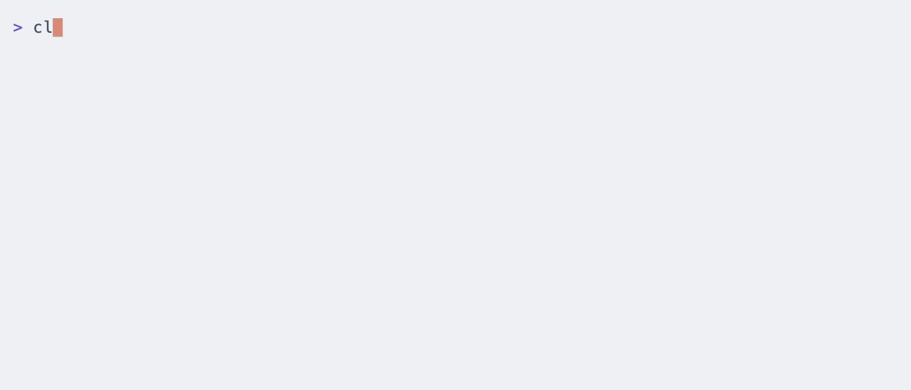
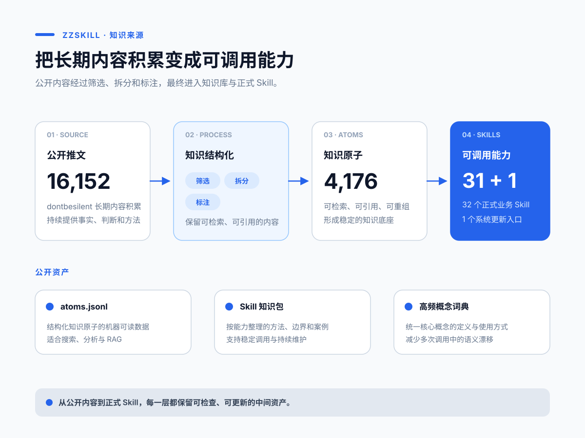

# zzskill

> **Attribution**: This directory is adapted from [dontbesilent2025/dbskill](https://github.com/dontbesilent2025/dbskill) by [dontbesilent](https://x.com/dontbesilent), licensed [CC BY-NC 4.0](https://creativecommons.org/licenses/by-nc/4.0/). Only identifiers were renamed (`dbs` -> `zz`, `dbskill` -> `zzskill`) and install commands repointed to this repository. The methodology, skill prompts and knowledge base are unmodified.

[简体中文](README.md) | English | [日本語](README.ja.md) | [한국어](README.ko.md) | [繁體中文](README.zh-TW.md)

> A Chinese AI Skills toolkit for entrepreneurs and content creators. Give your Agent a real business, content, or execution problem, and get a clear judgment plus the next action you can take.

[](VERSION)
[](docs/新手入门.md#skill-全目录)
[](LICENSE)

**Supported in Doubao, WorkBuddy, Claude Code, Codex, and other Agents that support Skills.**

The methodology was created by [dontbesilent](https://x.com/dontbesilent); this directory is an adaptation of that open-source release. It distills 4,176 structured knowledge atoms and 32 directly callable business Skills from 16,152 public posts.

**v2.18.40:** Theory grounding is now available as a standalone Skill for auditing claims, verifying sources, and defining case boundaries.

[Quick start](#quick-start) · [Install](#install) · [Capabilities](#capabilities) · [Full guide](docs/新手入门.md) · [Changes](https://github.com/dontbesilent2025/dbskill/commits/main)


## What zzskill helps you solve

You do not need to learn a complex methodology first, or know which tool to invoke. Give `/zz` your current business situation, material, decision, or blocker. It decides whether one Skill is sufficient; complex tasks can use one lead Skill and up to two supporting Skills.

| Situation | What you get |
| --- | --- |
| Customers say your offer is expensive | Business diagnosis, risks, and validation actions |
| You have a topic but cannot turn it into watchable content | Content direction, hooks, titles, and script improvements |
| You know what to do but cannot move forward | Analysis of the blocker and one concrete starting action |
| You keep facing similar decisions without accumulating experience | Decision records, patterns, and snapshots |
| Your drafts, topics, and cases are scattered | A maintainable content-asset project |

## Quick start

After installation, enter this in your Agent:

```text
/zz I run coding classes for children. I have 40 paid students, but renewals are low.
Help me determine whether the issue is the product, pricing, or customer segment.
```

`/zz` reads the current conversation, explains its selection, and generates a prompt you can send directly. Add new facts or feedback after a round, then call `/zz` again to reassess the current task.

When you already know the task, call a Skill directly:

```text
/zz-diagnosis I offer home-organization consulting for mothers. Clients say it is expensive. What should I change?
/zz-content I want to discuss “ordinary people should not rush into building a personal brand.” How can I turn this into content?
/zz-hook Here are the first 20 seconds of my video script. Improve the opening: …
/zz-benchmark I want to study enterprise-service content accounts. Which benchmarks should I research?
```

## Capabilities

| Goal | Main Skills | Typical output |
| --- | --- | --- |
| Evaluate a business, product, price, or customer | `/zz-diagnosis` | Diagnosis, risks, validation plan |
| Find and study benchmarks | `/zz-benchmark` | Benchmark shortlist and research framework |
| Audit an experiential claim and ground it in a credible theory | `/zz-theory-grounding` | Revised claim, theory anchor, case reinterpretation, and boundaries |
| Ground a problem in relevant fields and theories, then study historical analogies | `/zz-standard-answer` | Theory anchor, case matrix, conditional answer, and failure boundaries |
| Create topics, content, titles, and videos | `/zz-content`, `/zz-hook`, `/zz-xhs-title` | Direction and publishable copy |
| Extract short-video data and speech transcripts | `/zz-video-extract` | Work or account data plus Markdown transcripts filed by author and title |
| Check content risks before publishing | `/zz-content-risk-check` | Machine-review signals, substantive issues, and minimal edits |
| Review resonance, logic, and reach | `/zz-resonate`, `/zz-script-flow`, `/zz-spread` | Prioritized edits |
| Clarify concepts, goals, and questions | `/zz-deconstruct`, `/zz-goal`, `/zz-good-question` | Testable definitions and goals |
| Work through procrastination and execution blocks | `/zz-action` | Blocker analysis and next action |
| Record and review long-term decisions | `/zz-decision`, `/zz-save`, `/zz-restore`, `/zz-report` | Local decision archive and reports |
| Build content assets and multi-Agent workflows | `/zz-content-system`, `/zz-agent-migration`, `/zz-install-skill` | Local project, topic map, and installation plan |
| Turn a local folder into a knowledge base | `/zz-knowledge` | Knowledge navigation, version rules, and ready-to-use prompts |

See the [full guide and Skill directory](docs/新手入门.md#skill-全目录) for all 32 business Skills, examples, and workflows.

## Install

### Recommended: Claude Code, Doubao, WorkBuddy, Codex, and other Agents supporting Skills

Run in a terminal:

```bash
npx -y skills add zhouliu83-hue/my-ai-os -g --all
```

Return to your Agent and enter `/zz 新手入门` to begin.

### Claude Code marketplace

You can also install the complete toolkit through the Claude Code marketplace:

```bash
claude plugin marketplace add zhouliu83-hue/my-ai-os
claude plugin install zz@zhouzheng-skills
```

The `zz` plugin includes all 32 public business Skills plus the `zz-update` system entry. Claude Code namespaces plugin Skills: use `/zz:zz` for the main entry and commands such as `/zz:zz-diagnosis` for a specific capability.

To install only one capability, choose its marketplace plugin, for example `claude plugin install zz-diagnosis@zhouzheng-skills`.



### Update

Ask your current Agent:

```text
更新 zzskill
```

This syncs the official zzskill and does not modify records, reports, or decisions under `~/.zz/`. See the [commit history](https://github.com/dontbesilent2025/dbskill/commits/main) for changes.

## How it works

```text
A real task
   ↓
/zz reads context and decides between one Skill or a composition
   ↓
It generates a directly usable task prompt
   ↓
The selected Skills deliver one unified result
   ↓
Add results and feedback, then reassess the task
```

## Knowledge base and local records

The repository includes 4,176 structured knowledge atoms, methodology documents organized by Skill, and a high-frequency concept glossary.

- Read the [atom library guide](知识库/原子库/README.md) for data scope and fields.
- Use `知识库/原子库/atoms.jsonl` to build your own RAG.
- Browse the [Skill knowledge packs](知识库/Skill知识包) for the methods.
- Use `/zz-save`, `/zz-restore`, and `/zz-report` for work across conversations. Data stays locally in `~/.zz/`.



## Author and support

Author: [@dontbesilent](https://x.com/dontbesilent) · [Xiaohongshu](https://xhslink.com/m/637xuspR4iI) · [Douyin](https://v.douyin.com/pRUDhpBqOrc/)

For paid Q&A support, scan the QR code or see the [group details](https://mp.weixin.qq.com/s/RpwNjMo4M_er4GOrfCYt1g).


## License

Licensed under [CC BY-NC 4.0](LICENSE).

- Personal use, study, research, and non-commercial projects are welcome.
- Please attribute the source when you publish derivative work.
- Commercial use requires separate authorization. Contact the author.
