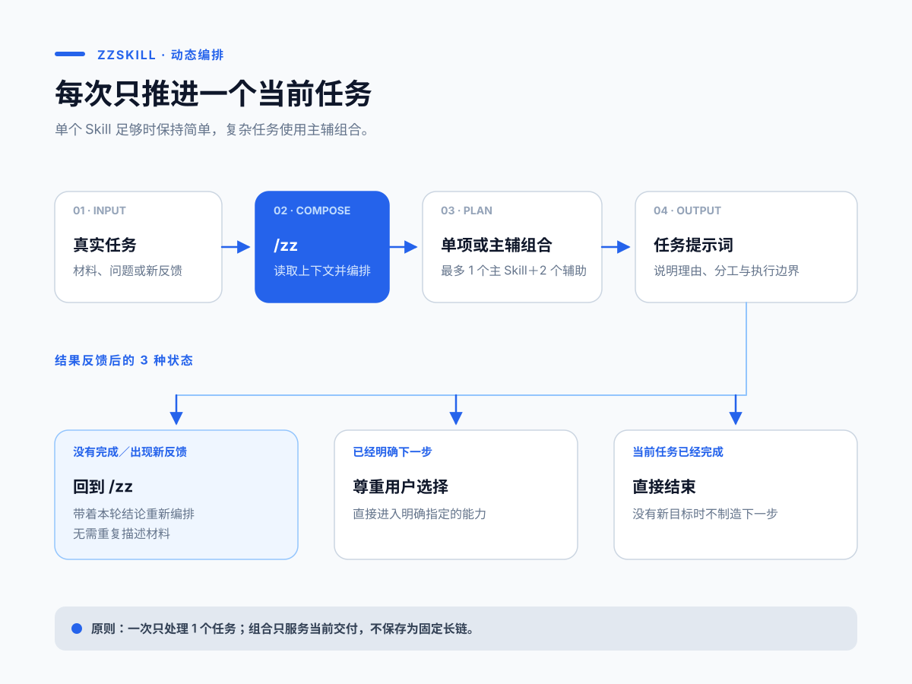

# zzskill

> **来源声明**：本目录改编自 [dontbesilent2025/dbskill](https://github.com/dontbesilent2025/dbskill)（作者 [dontbesilent](https://x.com/dontbesilent)，License [CC BY-NC 4.0](https://creativecommons.org/licenses/by-nc/4.0/)）。本次仅重命名标识符（`dbs` → `zz`、`dbskill` → `zzskill`）并将安装命令指向本仓库；方法论、Skill 提示词与知识库内容未作修改。

简体中文 | [English](README.en.md) | [日本語](README.ja.md) | [한국어](README.ko.md) | [繁體中文](README.zh-TW.md)

> 面向创业者与内容创作者的中文 AI Skills 工具箱。把真实业务、内容与行动问题交给 Agent，获得清晰判断和可以立刻执行的下一步。

[](VERSION)
[](https://skills.sh/dontbesilent2025/dbskill)
[](LICENSE)

**支持：豆包、WorkBuddy、Claude Code、Codex，以及其他支持 Skills 的 Agent。**

本工具箱的方法论由 [dontbesilent](https://x.com/dontbesilent) 创建。本目录为其开源版本的改编版。从 16,152 条公开推文中筛选、结构化出 4,176 个知识原子，并将其中的方法沉淀为 32 个可直接调用的 Skills。

**v2.18.40 更新：** 理论溯源现可独立调用，快速核验命题、理论来源与案例边界。

[快速开始](#快速开始) · [安装](#安装) · [能力一览](#能力一览) · [公开推文集](#公开推文集) · [完整使用手册](docs/新手入门.md) · [更新记录](https://github.com/dontbesilent2025/dbskill/commits/main)



## zzskill 解决什么问题

你不需要先学会一套复杂的方法，也不需要知道该调用哪个工具。把当下的业务、材料、选择或卡点交给 `/zz`，它会根据对话上下文判断单个 Skill 是否足够；复杂任务可以编排 1 个主 Skill 和最多 2 个辅助 Skill。

| 真实处境 | 你会得到 |
| --- | --- |
| 客户总说贵，不知道该改价格、产品还是客群 | 商业模式诊断、风险判断和验证动作 |
| 有一个选题，却做不出能被人看完的内容 | 内容方向、开头、标题与逐字稿优化 |
| 知道该做什么，却迟迟推不动 | 对行动卡点的分析和一条可开始的动作 |
| 反复面对同类选择，经验无法积累 | 可回填的决策记录、规律与阶段快照 |
| 文稿、选题、案例散落在多个文件夹 | 可持续维护的内容资产工程 |
| 本地资料很多，希望 Agent 能稳定查找和调用 | 基于文件夹的知识库导航、版本规则与使用入口 |

## 快速开始

安装完成后，直接在 Agent 中输入：

```text
/zz 我做少儿编程课，已经有 40 个付费学员，但续费率很低。
我需要判断问题出在产品、定价，还是我找错了客户。
```

`/zz` 会读取当前对话信息，说明推荐理由，并生成一段可以直接继续发送的提示词。完成一轮后，继续补充新的事实或反馈，再输入 `/zz`，它会重新判断当前任务需要单项还是组合。

已经知道需求时，可以直接调用具体 Skill：

```text
/zz-diagnosis 我做面向宝妈的收纳咨询，客户总觉得贵。我该调整什么？
/zz-content 我想讲“普通人别急着做个人 IP”，这个选题怎样做成内容？
/zz-hook 这是我短视频前 20 秒的逐字稿，帮我优化开头：……
/zz-benchmark 我想研究企业服务内容账号，应该找哪些对标？
/zz-knowledge 帮我把这个文件夹变成知识库，以后我想直接从里面找资料。
```

## 能力一览

| 工作目标 | 主要入口 | 常见产出 |
| --- | --- | --- |
| 判断生意、产品、定价与客户 | `/zz-diagnosis` | 商业诊断、风险、验证方案 |
| 找对标并提炼可学习的部分 | `/zz-benchmark` | 对标筛选与研究框架 |
| 审查经验判断并找到可信理论依据 | `/zz-theory-grounding` | 命题修正、理论锚点、案例重释与适用边界 |
| 先挖掘相关领域、作者和可信理论，再研究历史同构答案 | `/zz-standard-answer` | 理论锚点、案例矩阵、条件性答案与失效边界 |
| 做选题、内容、标题与短视频 | `/zz-content`、`/zz-hook`、`/zz-xhs-title` | 内容方向与可发布文案 |
| 提取短视频数据和语音文字稿 | `/zz-video-extract` | 作品／账号数据、按作者和标题归档的 Markdown 文字稿 |
| 发布前检查敏感词、导流、广告与受限内容 | `/zz-content-risk-check` | 机器审核信号、内容实质问题与最小修改动作 |
| 检查文稿共鸣、逻辑与传播性 | `/zz-resonate`、`/zz-script-flow`、`/zz-spread` | 修改意见与优先级 |
| 澄清概念、目标和问题 | `/zz-deconstruct`、`/zz-goal`、`/zz-good-question` | 可验证的定义与行动目标 |
| 处理拖延和行动受阻 | `/zz-action` | 卡点分析与下一步动作 |
| 记录、复盘长期决策 | `/zz-decision`、`/zz-save`、`/zz-restore`、`/zz-report` | 本地决策档案与报告 |
| 建立和治理文件夹知识库 | `/zz-knowledge` | 知识库导航、版本规则、健康检查与 SOT 分层瘦身 |
| 建立内容资产与多端 Agent 工作台 | `/zz-content-system`、`/zz-agent-migration`、`/zz-install-skill` | 本地工程、主题地图与安装方案 |
| 把反复问题制作成单个 Skill | `/zz-skill-maker` | 可安装 Skill、分级验证结果与可选 GitHub 发布仓库 |

完整的 32 个 Skill、适用时机、输入示例和动态导航方式，见 [新手入门与 Skill 全目录](docs/新手入门.md#skill-全目录)。

## 安装

### 推荐：Claude Code、豆包、WorkBuddy、Codex 与其他支持 Skills 的 Agent

在终端执行：

```bash
npx -y skills add zhouliu83-hue/my-ai-os -g --all
```

安装后回到 Agent，输入 `/zz 新手入门` 即可开始。

### Claude Code 插件市场

也可以通过 Claude Code 插件市场安装完整工具箱：

```bash
claude plugin marketplace add zhouliu83-hue/my-ai-os
claude plugin install zz@zhouzheng-skills
```

这个 `zz` 插件包含 32 个正式业务 Skill 和 1 个 `zz-update` 系统更新入口。Claude Code 会为插件 Skill 添加命名空间：主入口使用 `/zz:zz`，具体能力例如 `/zz:zz-diagnosis`。

只想安装一个能力时，可以在插件市场中选择对应插件，例如 `claude plugin install zz-diagnosis@zhouzheng-skills`。


### 更新

已安装 zzskill 时，直接对当前 Agent 说：

```text
更新 zzskill
```

它会同步官方 zzskill，不会修改你在 `~/.zz/` 中的存档、报告和决策记录。版本变化见 [提交记录](https://github.com/dontbesilent2025/dbskill/commits/main)。

## zzskill 怎样工作

```text
真实任务
   ↓
/zz 读取上下文并判断单项或组合
   ↓
生成一段可直接继续发送的提示词
   ↓
入选 Skill 交付一份统一结果
   ↓
补充结果与反馈，再重新编排
```

zzskill 每次只处理一个当前任务。单个 Skill 能覆盖时保持简单；任务包含独立且必要的要求时，使用主辅组合共同交付一份结果。

## 知识库与本地记录

仓库公开了 4,176 条结构化知识原子、按 Skill 整理的方法论文档与高频概念词典。

- 想查看数据范围和字段，阅读 [原子库说明](知识库/原子库/README.md)。
- 想构建自己的 RAG，可使用 `知识库/原子库/atoms.jsonl`。
- 想了解各项方法，浏览 [Skill 知识包](知识库/Skill知识包)。
- 想把自己的本地文件夹直接当作知识库，使用 `/zz-knowledge` 建立导航并持续查找、收录和调用资料。
- 想跨对话保留工作，使用 `/zz-save`、`/zz-restore` 与 `/zz-report`。数据默认保存在用户本机的 `~/.zz/`。

## 公开推文集

公开推文集收录经过整理的 dontbesilent 推文原文，提供两种格式：

- [Markdown 阅读版](books/dontbesilent-开源推文集.md)：适合搜索、复制和交给 AI 分析。
- [PDF 阅读版](books/dontbesilent-开源推文集.pdf)：适合完整阅读和下载保存。

推文集与 Skills 安装包相互独立。执行 `npx -y skills add zhouliu83-hue/my-ai-os -g --all` 时，安装的是 Skills，不会自动下载推文集。


## 共同贡献者

`zz-content-risk-check` 的敏感词检查能力由以下共创者共同完善，他们的贡献不可替代：

- [@Ronnie2025](https://github.com/Ronnie2025)
- [@非著名投放小沈](https://xhslink.cn/m/4NSBjmZTC1j)

## 作者与支持

作者：[@dontbesilent](https://x.com/dontbesilent) · [小红书](https://xhslink.com/m/637xuspR4iI) · [抖音](https://v.douyin.com/pRUDhpBqOrc/)

如需加入付费答疑群，可扫码或打开 [答疑群说明](https://mp.weixin.qq.com/s/RpwNjMo4M_er4GOrfCYt1g)。


## 许可证

本项目采用 [CC BY-NC 4.0](LICENSE) 许可证。

- 个人使用、学习、研究与非商业项目可以直接使用。
- 公开发布衍生作品时，请注明来源。
- 商业用途需要单独授权，请联系作者。
